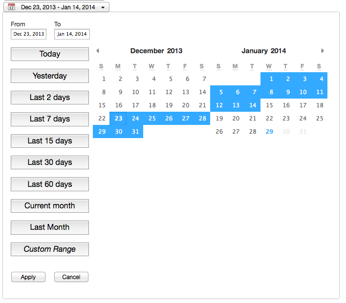

# DateRanger

> A simple date range picker with just tiny dependencies

_It has minimal styles, because you need to adapt to current app everytimes_ :)

## Usage

Can work using CommonJS (eg: browserify), AMD (eg: requirejs) or globally.

Checkout [the example file](index.html) to know how to use it (at least for now).

# Browsers Compatibility

- Firefox
- Chrome
- IE 9+ (I guess, but should works with some polyfills)
- Safari (I guess)

## Todo

- make momentjs optional
- make pikaday optional
- make a real README
